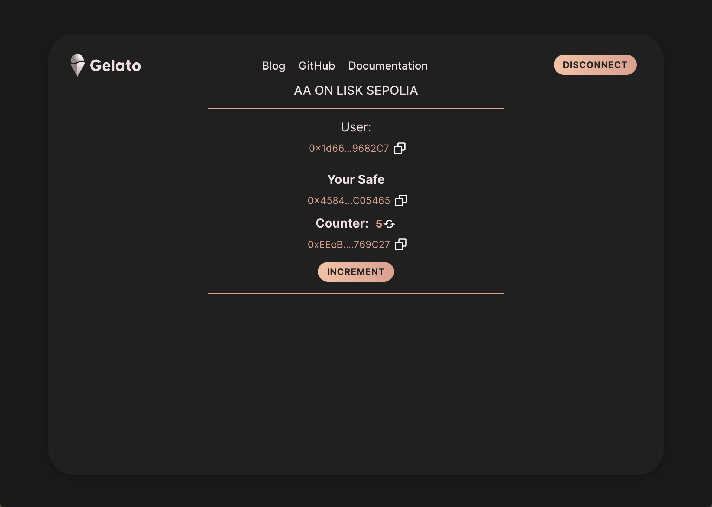

# Raas AA UI starter Kit

This project showcases a React implementation of how to use web3Auth with Safe and Gelato on Gelato Raas.

## Web3 App

[https://gelato-raas-op-ui.web.app/](https://gelato-raas-op-ui.web.app/)

 

### Quick Start

Please add your sponsor key in here [here](/src/components/App/index.tsx#32) :

```
  const GELATO_RELAY_API_KEY = "YOUR GELATO SPONSOR KEY";
```

```
yarn start
```

### Code Snippets

**Web3Auth instantiation**

```typescript
const web3auth = new Web3Auth({
  clientId:
    "BFolnrXUpJ8WScbI0MHGllgsP4Jgyy9tuAyfd4rLJ0d07b1iGMhZw3Eu2E10HECY2KIqYczag4_Z4q7KsEojUWU", // get it from Web3Auth Dashboard
  web3AuthNetwork: "sapphire_devnet",
  chainConfig: {
    chainNamespace: "eip155", 
    chainId: "0xA455",
    rpcTarget: "https://rpc.op-testnet.gelato.digital",
    // Avoid using public rpcTarget in production.
    // Use services like Infura, Quicknode etc
    displayName: "OpTest",
    blockExplorer: "https://blockscout.op-testnet.gelato.digital",
    ticker: "ETH",
    tickerName: "ETH",
  },
});
await web3auth!.initModal();

const web3authProvider = await web3auth!.connect();

const provider = new ethers.providers.Web3Provider(web3authProvider!);
```

**Predict Safe Address**  
It is worth noticing that the Safe will be deployed when sending the first transaction.

```typescript
const relayPack = new GelatoRelayPack(GELATO_RELAY_API_KEY);
const safeAccountAbstraction = new AccountAbstraction(signer!);
const sdkConfig: AccountAbstractionConfig = {
  relayPack,
};
await safeAccountAbstraction.init(sdkConfig);

const safeAddress = await safeAccountAbstraction.getSafeAddress();
const isDeployed = await safeAccountAbstraction.isSafeDeployed();
```

**Send Gasless Transaction**

```typescript
const { data: dataCounter } =
  await tmpCountercontract!.populateTransaction.increment();
const gasLimit = "10000000";
const txConfig = {
  to: targetAddress,
  data: dataCounter!,
  value: "0",
  operation: 0,
  gasLimit,
};

const safeTransactions: MetaTransactionData[] = [
  {
    to: txConfig.to,
    data: txConfig.data,
    value: txConfig.value,
    operation: OperationType.Call,
  },
];
const options: MetaTransactionOptions = {
  gasLimit: txConfig.gasLimit,
  isSponsored: true,
};
let web3AuthSigner = signer;
try {
  const privateKey = ("0x" +
    (await web3auth!.provider!.request({
      method: "eth_private_key",
    }))) as string;
  web3AuthSigner = new ethers.Wallet(privateKey!, provider!);
} catch (error) {}
const relayPack = new GelatoRelayPack(GELATO_RELAY_API_KEY);

const safeAccountAbstraction = new AccountAbstraction(signer!);
const sdkConfig: AccountAbstractionConfig = {
  relayPack,
};
await safeAccountAbstraction.init(sdkConfig);

const response = await safeAccountAbstraction.relayTransaction(
  safeTransactions,
  options
);
```
